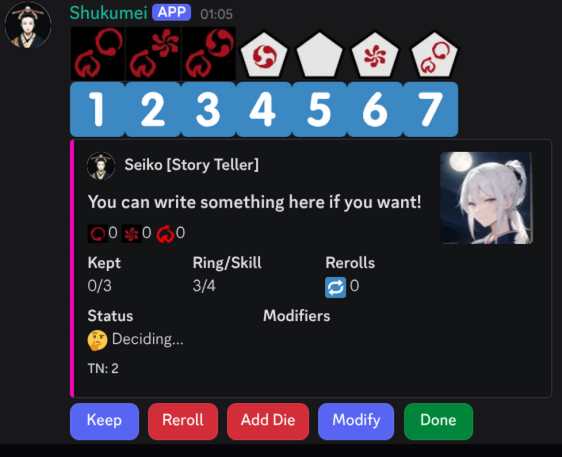

# Shukumei 1.2.1

Shukumei means fate, and what are dice for but for deciding your fate? 

This is a simple dice bot configured specifically for using in discord for those running [Legend of the Five Rings 5th Edition (Created by Edge Studios under license of Fantasy Flight Games)](https://www.edge-studio.net/games/l5r-core-rulebook/).

This contains additional commands unique to the game system, such as Prediction and Staredown for duels, with easy to read output.
It also implements the interactive roll and keep system of course.

Developed with the assistance of Logos who provided commentary and useful ideas. You know who you are :)

QA Team: Snowbear, Logos, jhunal, Moonlit, and all the other players and fellow GMs who used it!

[Privacy Policy](https://github.com/sachieko/shukumei/blob/main/PRIVACYPOLICY.md)
[Terms of Service](https://github.com/sachieko/shukumei/blob/main/TERMSOFSERVICE.md)

## Example of Use

# How to Install in your Discord Server

Simply use this link [https://discord.com/oauth2/authorize?client_id=1297430172886241373](https://discord.com/oauth2/authorize?client_id=1297430172886241373) and follow the steps to select the server you would like to add it to. It does not currently function as a personal app.

The bot will be discoverable in discord's app directory only if it's used in 100+ servers.

## Working Commands

* Ping: Confirm the bot is working and responding
* Predict: Predict the stance another user in discord will take on their next turn, revealing only at the end.
* Reminder: Set a discord timestamp that can ping a specific role of users (such as those in the game on a server) for a future date.
* Staredown: Bid strife against another player or yourself (for GMs and NPCs), revealing the results only once everyone has bid.
* Roll: Perform a roll given a starting amount of ring and skill dice as well as keeping dice, including whether assistance was given or void points spent. Unkeeping is also supported now. 
* Help: `/help` commands have been created and recommended if you aren't sure how to use Shukumei!

Rolls have indexes to help players track which dice they wish to keep.

### Commands in Development

* None. Connecting to an SQL backend for version 2.0 update has been postponed indefinitely, as the performance benefits are negligible.

## FAQ

* Having issues getting it working? Make sure Shukumei has access to the channel in your discord server if you have complicated permissions for channels! It needs to be able to see the channel and edit its own messages! This is not something I can change for you, so make sure you understand your server's permission settings.
* Found a bug? Please make an issue if you are able! Or drop me a message and I'll get to it :)
* Want me to make it work for other editions? I have no plans to unfortunately. Lots of other dice bots already do that.
* Have a feature idea? I'll consider it depending on how complicated it is and the benefit. :)

## How to run as your own dice bot.

1. Clone the repository, then use `npm install` to install necessary NPM packages
2. Fill in the necessary information for your discord bot in a `.env` file
3. Run `npm run build` to create the program
4. Run `npm run deploy` to deploy commands to the bot.
5. Run `npm start` to start the bot.

